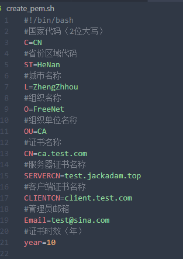
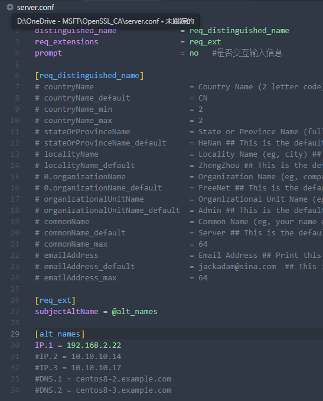
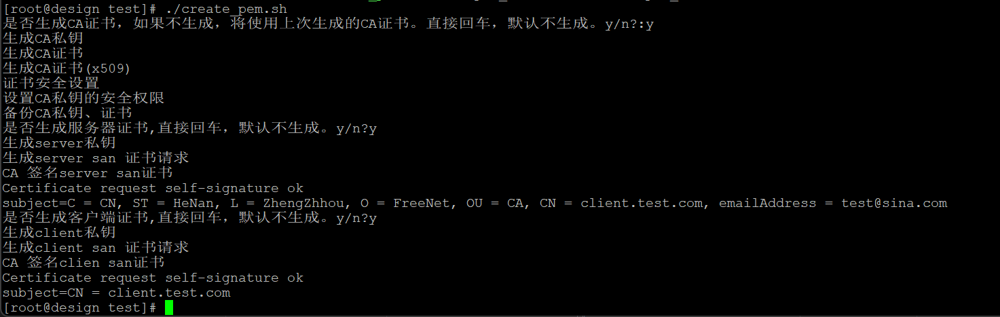

# OpenSSL_CA

OpenSSL implements CA servers.

该脚本将使用Open SSL，实现CA服务器功能。

以前很多脚本都是自签证书，无法为多个自签证书做统一授信。

这个是统一CA签发证书，将方便统一授信。

未测试：应该可以拿这里生成证书申请去windowsCA中心签发，那就域内自动信任了。

该项目将精简后为仅提供https的服务做插件。尤其是这几天在做的 [mozilla/send: Simple, private file sharing from the makers of Firefox (github.com)](https://github.com/mozilla/send)

修改create_pem.sh头部信息。

修改server.conf，主要是许可的IP，域名

修改client.conf，主要是email，也就是完整的域用户账号。不生成客户端证书可以不用。

执行create_pem.sh，交互选择即可生成证书。

生成的CA证书会保存在CA目录。

生成的server，client证书保存在certificate目录。

如果使用CA中心，可以将CA证书下发到授信的证书，那么由CA签发的证书则自动全部信任。

第二次使用，可以不生成CA证书。

todo:

    或许会做人机交互，配置存配置文件。但是这东西这么简单，似乎没有必要。
